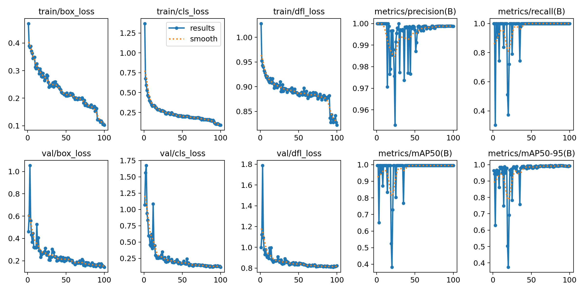
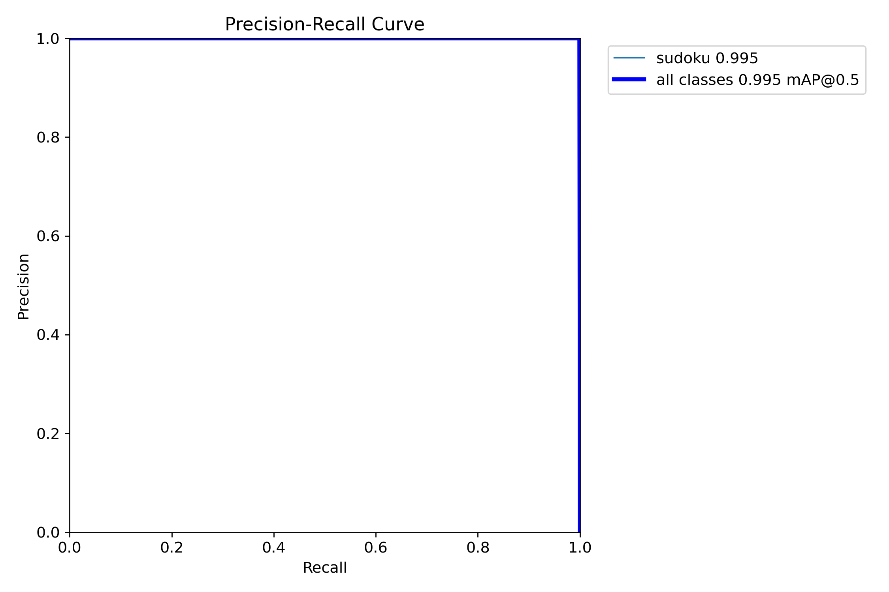
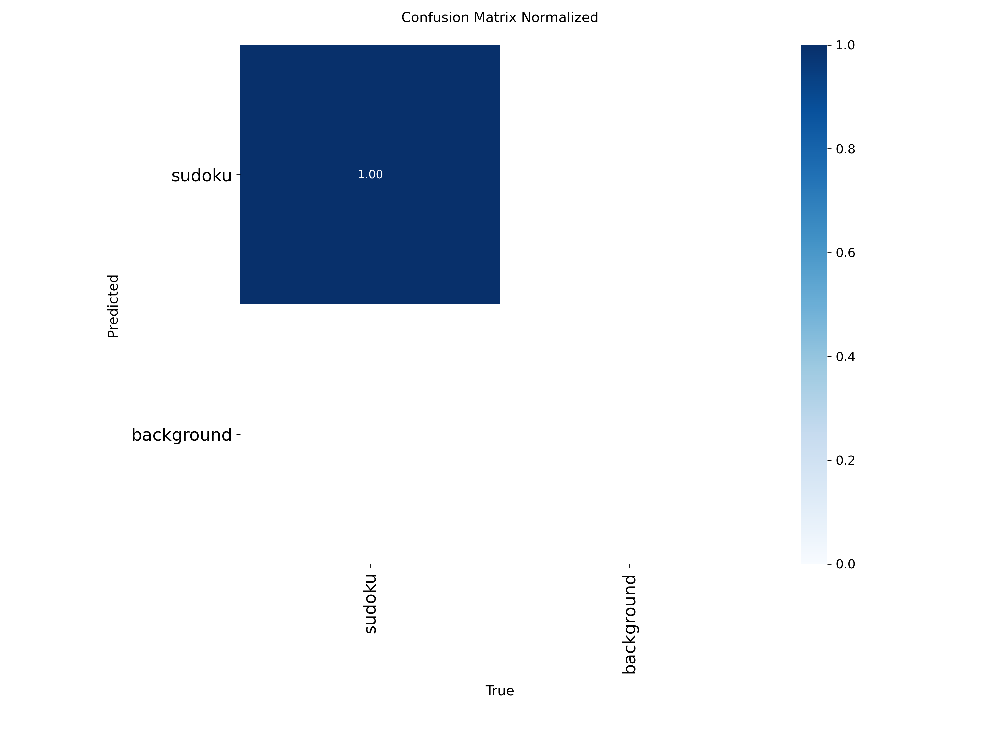
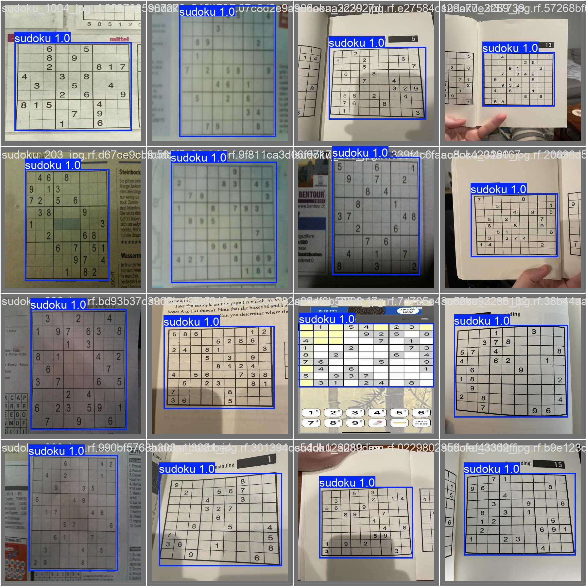
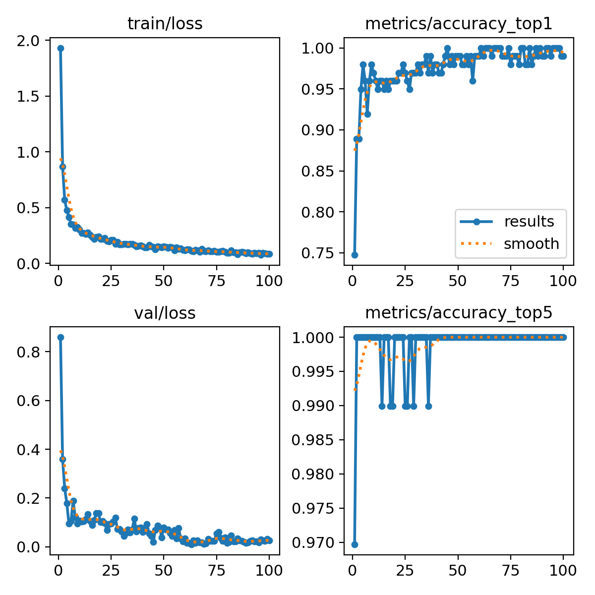
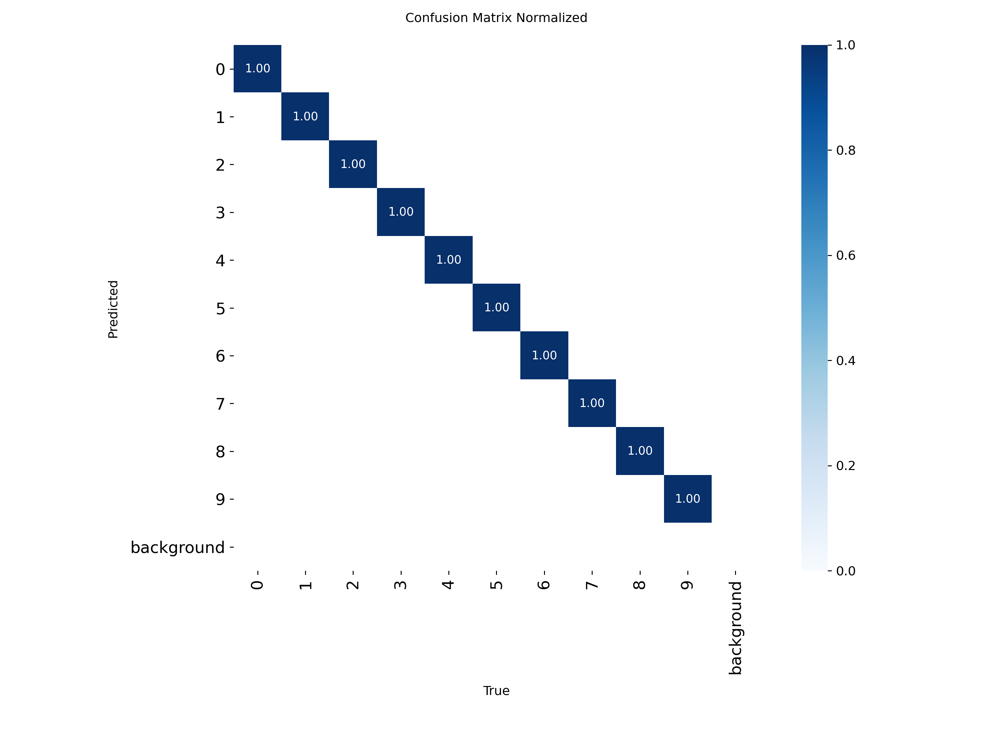
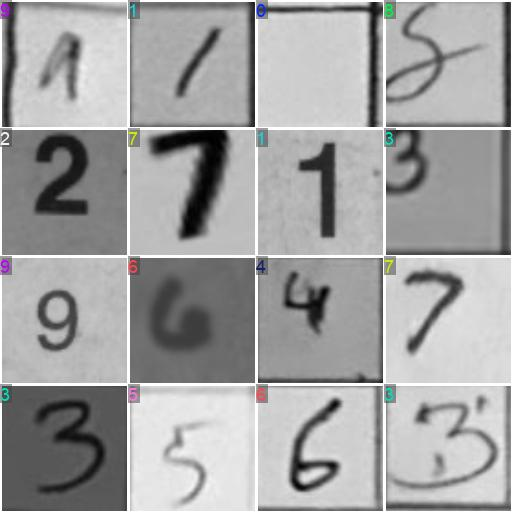

# CV Sudoku Solver


Photograph a Sudoku puzzle and get the solution instantly.

---

## Model Performance

### Grid Detection
- **99.5% mAP50** — mean average precision at 50% IoU threshold
- **99.9% Precision** — minimal false positives
- **100% Recall** — detects every grid

### Digit Recognition
- **99.0% Top-1 Accuracy** — correct digit on first prediction
- **100% Top-5 Accuracy** — correct digit always in top 5 predictions
- **10-class classifier** — digits 1-9 plus empty cells

### Robustness
- Printed and handwritten puzzles
- Varying lighting and exposure
- Skewed camera angles
- Any paper color or background

---

## Models

### Grid Detection Model

Locates Sudoku grids in photographs using YOLOv8 object detection.

| Specification | Value |
|---------------|-------|
| Architecture | YOLOv8 Nano |
| Input Size | 416×416 |
| Epochs | 100 |
| Dataset | 500+ images (Roboflow) |
| Hardware | Apple Silicon GPU (MPS) |

**Training Results**

<table>
<tr>
<td width="50%">

**Training Curves**



</td>
<td width="50%">

**Precision-Recall Curve**



</td>
</tr>
<tr>
<td>

**Confusion Matrix**



</td>
<td>

**Validation Predictions**



</td>
</tr>
</table>

---

### Digit Classification Model

Identifies digits 1-9 in individual cells using YOLOv8 classification.

| Specification | Value |
|---------------|-------|
| Architecture | YOLOv8 Nano Classification |
| Input Size | 128×128 |
| Batch Size | 32 |
| Epochs | 100 |
| Classes | 10 (digits 1-9 + empty) |
| Hardware | Apple Silicon GPU (MPS) |

**Training Results**

<table>
<tr>
<td width="50%">

**Training Curves**



</td>
<td width="50%">

**Confusion Matrix**



</td>
</tr>
<tr>
<td colspan="2">

**Validation Samples**



</td>
</tr>
</table>

---

## How It Works

1. **Detect** — YOLOv8 locates the Sudoku grid in your photo
2. **Warp** — OpenCV corrects perspective to create a perfect square
3. **Split** — Grid is divided into 81 individual cells
4. **Recognize** — YOLOv8 classifier identifies each digit
5. **Solve** — Constraint propagation + backtracking finds the solution
6. **Render** — Solution is drawn onto a clean grid image

---

## Solving Algorithm

Uses a hybrid approach:

1. **Constraint Propagation** — Eliminates impossible values by checking rows, columns, and 3x3 blocks. Solves most puzzles without guessing.

2. **Backtracking Search** — For harder puzzles, tries possibilities and backtracks when stuck. Guarantees a solution if one exists.

Solves any valid Sudoku in under 100ms.

---

## Project Structure

```
backend/
├── sudoku_detector/     # Computer vision pipeline
│   ├── services/        # Detection, warping, recognition
│   ├── training/        # Model training scripts
│   └── models/          # Trained weights (.pt files)
├── sudoku_solver/       # Solving algorithms
└── sudoku_display/      # Solution rendering
```

---

## Requirements

```
numpy>=1.21.0
opencv-python>=4.5.0
Pillow>=8.0.0
torch>=1.10.0
ultralytics>=8.0.0
```